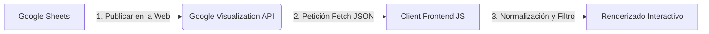

# Atlantida Cafe - Minimalist Bar Menu (Google Sheets Integration)

Este proyecto representa el frontend de un pipeline de **Ingeniería de Datos** serverless que consume información de una base de datos alojada en **Google Sheets** en tiempo real. 

La web cuenta con un diseño minimalista premium, animaciones sutiles, filtros por categoría y un panel de depuración para visualizar el estado y estadísticas de la ingesta de datos.

---

## 🛠️ Arquitectura del Pipeline de Datos



1. **Origen (Base de Datos)**: Una hoja de cálculo en Google Sheets que actúa como CMS/Base de datos estructurada.
2. **Ingesta (API)**: Consumo del endpoint de la API de Visualización de Google Sheets.
3. **Procesamiento (Frontend)**: Parser en JavaScript que transforma la estructura visual de Google en un array plano de objetos con propiedades normalizadas en español e inglés, filtrando los elementos marcados como no disponibles (`disponible: FALSE`).
4. **Destino (UI)**: Interfaz minimalista premium optimizada para dispositivos móviles (menú táctil).

---

## 📋 Configuración del Google Sheet (Paso a Paso)

Para conectar tu propia base de datos de Google Sheets, sigue estos pasos:

### 1. Preparar la estructura (Pestañas del Documento)

Tu archivo de Google Sheets debe contener dos pestañas (u hojas) inferiores:

#### A. Pestaña 1: `Carta` (La base de datos del menú)
La primera fila (fila 1) **debe contener exactamente** estos encabezados de columna:
* `ID`: Identificador numérico único del plato/bebida (ej: `1`).
* `Categoria`: Categoría para agrupar en la carta (ej: `Cócteles`, `Comida`, `Bebidas`).
* `Nombre`: Nombre del producto (ej: `Margarita de Mezcal`).
* `Descripcion`: Descripción de los ingredientes (ej: `Mezcal, sirope de agave, zumo de lima...`).
* `Precio`: Número decimal que indica el precio (ej: `9.50` o `9`).
* `Disponible`: Indica si se muestra en la web (`TRUE` para mostrar, `FALSE` para ocultar).
* `Imagen_URL` (Opcional): Enlace directo a una imagen del plato.

#### B. Pestaña 2: `Config` (La base de datos de enlaces/botones)
Crea una pestaña llamada exactamente `Config`. Esta hoja debe tener dos columnas en la fila 1: `Clave` y `Valor`. Añade los siguientes registros:
| Clave | Valor |
|---|---|
| `instagram_url` | *El enlace a tu perfil de reservas de Instagram* |
| `google_maps_url` | *El enlace a Google Maps de tu ubicación* |
| `reviews_url` | *El enlace para que tus clientes dejen opiniones en Google/TripAdvisor* |

*Nota: Si no creas la pestaña `Config`, la web funcionará perfectamente utilizando los enlaces por defecto configurados en el archivo `app.js`.*

### 2. Compartir y Publicar la Hoja
Para que la API pueda acceder a los datos sin credenciales pesadas de Google Cloud, debes hacer el documento legible públicamente:
1. Abre tu hoja en Google Sheets.
2. Haz clic en el botón superior derecho **Compartir**.
3. En *Acceso General*, cambia a **Cualquier persona con el enlace** en modo **Lector**.
4. Ve a **Archivo** > **Compartir** > **Publicar en la web**.
5. Haz clic en **Publicar** y confirma la acción (puedes cerrar la ventana emergente tras esto).

### 3. Obtener el ID de la Hoja
El ID del documento se encuentra en la URL de tu navegador:
`https://docs.google.com/spreadsheets/d/`**[ID_DE_TU_HOJA]**`/edit#gid=0`

Copia ese código alfanumérico largo.

### 4. Configurar el Archivo `app.js`
Abre el archivo [app.js](file:///C:/Users/andre/.gemini/antigravity/scratch/bar-menu-web/app.js) en tu editor y busca la siguiente línea en la parte superior:

```javascript
const DEFAULT_SPREADSHEET_ID = '1Zz98iY8wN_4HhFvSgP-P1o5iS9iQ-L476QeZ6aX11iA'; 
```

Reemplaza ese ID de prueba por el **ID de tu hoja** que copiaste en el paso anterior. ¡Guarda el archivo y listo! Tu web ahora se nutre de tus propios datos de Google Sheets.

---

## ⚡ Ejecución Local

Para probar el proyecto de forma local:

1. Abre una consola/terminal.
2. Navega al directorio del proyecto `bar-menu-web`.
3. Inicia un servidor web local simple. Por ejemplo, si tienes Python instalado:
   ```bash
   python -m http.server 8000
   ```
   O si tienes Node.js / `npx`:
   ```bash
   npx serve .
   ```
4. Abre tu navegador y ve a `http://localhost:8000`.

---

## ⚙️ Características Premium del Frontend
* **Esqueleto de Carga (Shimmer)**: Una simulación animada de las tarjetas del menú mientras se realiza la consulta a la API de Google Sheets, mejorando la percepción de velocidad.
* **Diseño Glassmorphism**: Fondos semi-translúcidos con desenfoque de cristal (`backdrop-filter`) que combinan de forma premium con las luces ambientales de fondo.
* **Depurador de Pipeline Integrado**: Un panel desplegable interactivo que muestra la URL del API utilizada, el ID del Sheet, el timestamp de la última sincronización y la cantidad de registros procesados. Excelente para presentaciones técnicas.
* **Alineación SEO**: Estructura de HTML5 semántica y etiquetas Meta descriptivas preparadas para indexación móvil.
